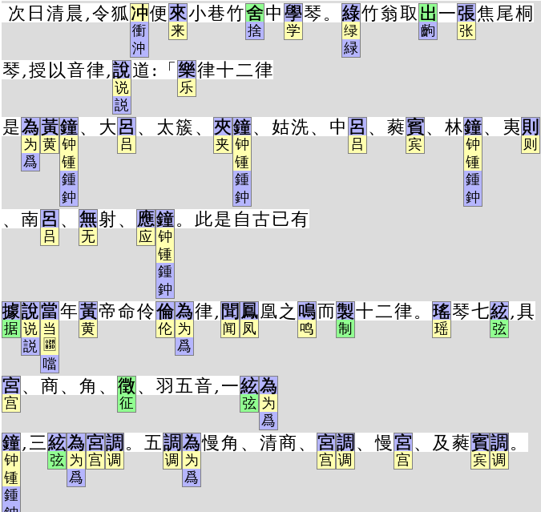

# 全文每个汉字关联字可视化

- 使用(in beta)：Web tool。直接打开 https://garywill.github.io/cc-visualize/
- CLI：计划中。有待将js代码的web部分与可复用部分解耦，并分离到不同文件中


## 作用

1. 学习汉字繁简关系、异体字。一眼看清一对多或多对多组合

2. 分辨网上泛滥的，机器简转繁造成的，大量“文献”所含有的大量错字

3. 找出大段文本中的非寻常字符：仅日本用的简化版汉字、兼容区汉字符、非中非英的其他语言符号等、扩展区的汉字（少用字）、笔划偏旁字符
    > Unicode的坑，除西文字符外，汉字也有**同形字符攻击**问题。已经发现有输入法码表中混入了不应有的字符。这也是做这个功能起因之一（见下相关背景资料）
    > 
    > 

## 非作用

只收录文本数据，即以计算机码位形式储存的数据，不收录图片、字形。

本项目关注的是，哪些码位在哪个地区属于日常可用或不应使用。

像同一码位字符在不同地区所显示的字形，某部件从「王」或从「壬」从「术」或从「朮」这一类研究，皆【不】是本项目关注的。
    
## 截图预览




颜色：
- 淡绿色：繁简合字（即，在转换表中既作为繁体也作为简体出现）
- 淡蓝色：繁体
- 淡黄色：中文简体
  > 受某一边数据可能遗漏的影响，被标作简体的字，不一定仅是简体字（按理说，繁体亦然）。
  > 
  > 被标作繁简合字的，也可能并非在繁中、简中两个文化圈中都是常见字

可能为非寻常字符的颜色：
- 红色：仅日文用简化字（也有可能是不常用的中文异体字或上古字，与日本简化同形）
- 红紫色：兼容汉字符 
- 蓝紫色：汉字笔划偏旁字符
- 橙色边框：扩展区汉字（一般为少见字）
- 灰色：未定义编码字符

> 本工具目前无法保证数据是100%准确的。如果发现错误之处，可以开issue告知。然后请先尝试向上游（数据来源）报告和修复。也可以在本工具中（预处理脚本内）使用手动更正方案

## 原理

汉字、字符关系数据来源：

- [OpenCC （Open Chinese Convert）](https://github.com/BYVoid/OpenCC)

- [Unicode Character Database (UCD)](https://www.unicode.org/ucd/) （及其子集Unihan）

- 中华地区中文教育常用字

- 可以再加....

### OpenCC

OpenCC含有中文繁简关系、日本用字与中文汉字关系

下例相当于把openCC的`STCharacters.txt`和`TSCharacters.txt`合并了

```json
"干": { "rel": [ "幹", "乾", "榦" ], "isSimp": true, "isTrad": true },
"幹": { "rel": [ "干", "乾", "榦" ], "isTrad": true },
"乾": { "rel": [ "干", "幹", "榦" ], "isTrad": true, "isSimp": true },
"榦": { "rel": [ "干", "幹", "乾" ], "isTrad": true },
```

`干幹乾榦`：`干`和`乾`既是简体也是繁体，`幹`和`榦`仅是繁体。以上储存在`opencc.map`

又，例如，`发發髮発髪`：中文繁简字皆互相关联，日本变体可关联到中文繁简字，但从中文字不需要关联到日本字。（这里又相当于把openCC的`HKVariants.txt`、`TWVariants.txt`、`JPVariants.txt`也合并了进来，期间排除了不必要的变体关联）

```json
"发": { "rel": [ "發", "髮" ], "isSimp": true },
"發": { "rel": [ "发", "髮" ], "isTrad": true },
"髮": { "rel": [ "发", "發" ], "isTrad": true },
"発": { "rel": [ "發", "发", "髮" ], "isVari_JP": true },
"髪": { "rel": [ "髮", "发", "發" ], "isVari_JP": true },
```

以上储存在`opencc.map2`

另外又有`opencc.map3`，关联更多，从中华字也能够找到日本字。

### Unicode Character Database (UCD)

当前UCD版本：15.0

UCD提供txt（文件数量多）和[xml](https://www.unicode.org/Public/15.0.0/ucdxml/)（单个大文件）两种数据格式。

含有任意字符所属语言区块、每个区块的码的范围。含有正常汉字字符（CJK统一表意字符区）与康熙部首区、兼容表意字符区、汉字笔划偏旁字符区。还有繁简、Z变体、语义变体、特殊主义变体之间的关系、笔划偏旁字符对应的独立汉字。还有每个字的提交者是来自哪个国家的研究组

下载了xml并进行缩小，删除不需要的信息。然后生成JSON格式的汉字关联表

采用的Unihan变体参数
- kSimplifiedVariant 这个字对应的简体字
- kTraditionalVariant 这个字对应的繁体字
- kCompatibilityVariant 这个兼容区字对应的统一区字
- kZVariant 相同字被多次编码（因为错误，或来源不同）
- EqUIdeo 这个笔划字符对应的统一字

然后生成`unicode_data.map`（仅繁简关系）和`unicode_data.map2`。例如
```json
"壮":{"rel":["壯","𡉟"],"isSimp":true,"isTrad":true},
"壯":{"rel":["壮","𡉟"],"isTrad":true},
"壮":{"rel":["壮","壯","𡉟"],"isComp":true},  // 兼容区字符 
"𡉟":{"rel":["壮","壯"]},  //扩展区字，少见字

"並":{"rel":["併","倂","并"],"isTrad":true},
"併":{"rel":["並","倂","并"],"isTrad":true},
"倂":{"rel":["並","併","并"]},
"并":{"rel":["並","併","倂"],"isSimp":true,"isTrad":true},
"倂":{"rel":["並","併","倂","并"],"isComp":true},  // 兼容区字 
"並":{"rel":["並","併","倂","并"],"isComp":true},  // 兼容区字

"⾨":{"rel":["門","门"],"isRad":true},  // 笔划偏旁字符
"門":{"rel":["门"],"isTrad":true},
"门":{"rel":["門"],"isSimp":true},
```

其他未采用的Unihan变体参数： kSemanticVariant, kSpecializedSemanticVariant, kSpoofingVariant

### 中华地区中文教育常用字

[《通用规范汉字表》](https://zh.wikisource.org/wiki/%E9%80%9A%E7%94%A8%E8%A7%84%E8%8C%83%E6%B1%89%E5%AD%97%E8%A1%A8)（官方链接提供的[原文件](http://www.gov.cn/gzdt/att/att/site1/20130819/tygfhzb.pdf)是图片PDF，因此采用wikisource.org文本）。分为三级：一级字表 3500字；二级字表 3000字；三级字表 1605字。其中一、二级在此认为皆是简体字，三级不视为一定是简体。

### 总数据

结合`opencc.map2`及`uncode_data.map2`生成总数据表使用

## 代码说明

文件名以`pre`开头的为预处理脚本。用于将原始数据生成`.js`包装的数据文件（文件内容类似`xxxx.xxx = { ..很多行... }`），以便于web使用。


## 其他的能够查到汉字变体、关联关系、资料的工具 

- [Unicode Utilities: Character Properties](https://util.unicode.org/UnicodeJsps/character.jsp)
- [Unicode Utilities: Confusables](https://util.unicode.org/UnicodeJsps/confusables.jsp)
- [Unihan Data](http://www.unicode.org/cgi-bin/GetUnihanData.pl)
- [Unicopedia Plus](https://github.com/tonton-pixel/unicopedia-plus)
- [Unicopedia Sinca](https://github.com/tonton-pixel/unicopedia-sinica)
- [字嗨](https://zi-hi.com/sp/uni/)

## 相关背景知识

- [Unicode相容字符](https://zh.wikipedia.org/wiki/Unicode%E7%9B%B8%E5%AE%B9%E5%AD%97%E7%AC%A6)
  > 在“CJK Compatibility Ideographs”块中，也包含一些[不是相容字符的字符](https://zh.wikipedia.org/wiki/Unicode%E7%9B%B8%E5%AE%B9%E5%AD%97%E7%AC%A6#%E7%9B%B8%E5%AE%B9%E5%9D%97)
- [Homoglyph](https://en.wikipedia.org/wiki/Homoglyph)
- [IDN homograph attack](https://en.wikipedia.org/wiki/IDN_homograph_attack)
- [Duplicate characters in Unicode](https://en.wikipedia.org/wiki/Duplicate_characters_in_Unicode)
- [Punycode Attack](https://www.google.com/search?q=punycode+attack) | [Punycode Phishing](https://www.google.com/search?q=punycode+phishing)

## 其他

1. [**大术专搜**](https://github.com/garywill/BigSearch/blob/master/src/README_zh.md)（推荐）（一个搜索、查询工具）中收集的汉语工具部分
2. [收集的汉字资源、字体、阅读器 等](https://gitlab.com/garywill/cc-resources/-/releases)
