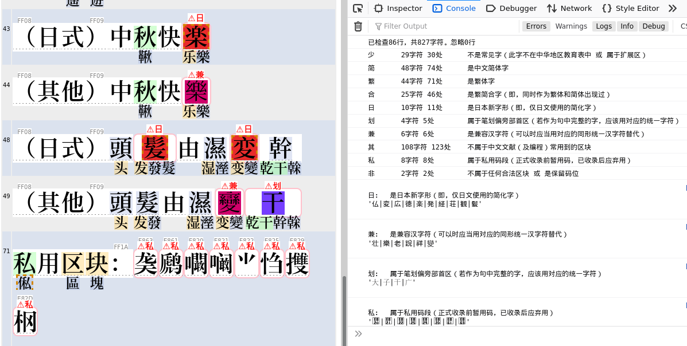
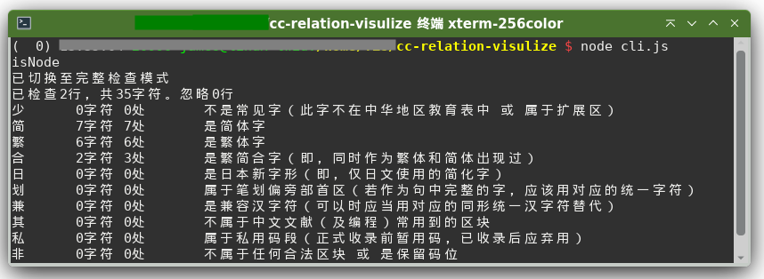

# 全文每个汉字关联字可视化 及 非寻常字符检视工具

使用(in beta)：
- Web tool: 直接打开 https://garywill.github.io/cc-visualize/
- CLI: 见下[进阶用户](#进阶用户)部分


## 作用

- 对汉字文化、汉语文献：

  - 充当小说阅读器。学习汉字繁简关系、异体字。一眼看清一对多或多对多组合
  
  - 分辨网上泛滥的，机器简转繁造成的，大量“文献”所含有的大量错字

- 对程序员：找出大段文本（Unicode的）中的非寻常字符，如
  - 零宽字符、控制字符、奇怪空格、组合字符等
    > 注意：若经复制粘贴、转换、浏览器控件，可能会丢掉或改变一些字符
  - 非汉、又非ASCII的不常用字符（对中文&编程用户）
  - 仅日本用的简化版汉字、兼容区汉字符、、少用汉字、笔划偏旁字符 等
    > 计算机汉字字符编码的坑，除西文字符外，汉字也有“**同形字符攻击**”问题。已经发现有输入法码表中含有可能混淆人的字符。这也是做这个功能起因之一（见下相关背景资料）
    > 
    > 

    
## 截图预览






UI对字符类型的示意：
- 淡绿色：繁简合字
- 淡蓝色：繁体
- 淡黄色：简体
  > 目前对一个字是简体还是合字、是繁体还是合字的判断，无法做到很准确。原则是尝试以当今各地区使用状况为准，【并非】考古或严谨的汉语汉字研究
- 可能为**非寻常**字符：
  - 红紫色：是兼容汉字符（可以时应当用对应的同形统一汉字符替代）
  - 蓝紫色：属于汉字笔划偏旁部首区（若作为句中完整的字，应该用对应的统一字符）
  - 红色：控制字符（包括不常用空白、零宽、排版控制等）
  - 暗红色：非合法编码的“字符”
  - 橙色虚线边框：可能只在汉字库较全或新的设备才显示的汉字
  - 橙色虚线边框：可能只在较新的设备才显示的非汉字字符
  - (无颜色)：不属于中文文献（及编程）常用到的区块
  - (无颜色)：属于私用码段（正式收录前暂用码，已收录后应弃用）
  - 浅红色：是日本新字体（即，仅日文使用的简化字）（也有可能是不常用的中文异体字或上古字，与日本简化同形）
  - 蓝色：是组合字符（无宽度无间距，用于给前一字符加声调等）


## 用字和编码问题的背景知识链接

<details>
<summary>关于同形字符： </summary>

- [Homoglyph](https://en.wikipedia.org/wiki/Homoglyph)
- [IDN homograph attack](https://en.wikipedia.org/wiki/IDN_homograph_attack)
- [Duplicate characters in Unicode](https://en.wikipedia.org/wiki/Duplicate_characters_in_Unicode)
- [Punycode Attack](https://www.google.com/search?q=punycode+attack) | [Punycode Phishing](https://www.google.com/search?q=punycode+phishing)

</details>


<details>
<summary>关于汉字同形字符： </summary>

- [Unicode相容字符](https://zh.wikipedia.org/wiki/Unicode%E7%9B%B8%E5%AE%B9%E5%AD%97%E7%AC%A6)
  > 在“CJK Compatibility Ideographs”块中，也包含一些[不是相容字符的字符](https://zh.wikipedia.org/wiki/Unicode%E7%9B%B8%E5%AE%B9%E5%AD%97%E7%AC%A6#%E7%9B%B8%E5%AE%B9%E5%9D%97)
- [“裏”（U+88CF）和“裏”（U+F9E7）这两个字有什么区别？ - 亜恵恵阿由的回答 - 知乎](https://www.zhihu.com/question/462402230/answer/1915726767)
- [为什么 Unicode 中会存在「凉」和「凉」这样两个极其相像的字符？ - 梁海的回答 - 知乎](https://www.zhihu.com/question/20697984/answer/15889940)

</details>


<details>
<summary>关于中文私用码段： </summary>

- Unicode中的[私人使用区](https://zh.wikipedia.org/wiki/%E7%A7%81%E4%BA%BA%E4%BD%BF%E7%94%A8%E5%8C%BA)
- [关于「宋体-PUA」 - 知乎](https://zhuanlan.zhihu.com/p/339951186)
- [你用字被PUA，求救取正出泥潭](https://zhuanlan.zhihu.com/p/360408639)
- [搜狗自造字为什么用非标准码，造了哪些字在哪里能查出来？ - Kushim Jiang的回答 - 知乎](https://www.zhihu.com/question/325533237/answer/701324778)
- [专业考试中心报名生僻字为什么不“生” - 知乎](https://zhuanlan.zhihu.com/p/340661670)

</details>

<details>
<summary>关于中文繁简对应问题： </summary>

- [漢字簡化爭論 多繁對一簡問題 - wikipedia](https://zh.wikipedia.org/wiki/%E6%BC%A2%E5%AD%97%E7%B0%A1%E5%8C%96%E7%88%AD%E8%AB%96#%E5%A4%9A%E7%B9%81%E5%B0%8D%E4%B8%80%E7%B0%A1%E5%95%8F%E9%A1%8C)
- [簡繁轉換一對多列表 - wikipedia](https://zh.wikipedia.org/wiki/%E7%B0%A1%E7%B9%81%E8%BD%89%E6%8F%9B%E4%B8%80%E5%B0%8D%E5%A4%9A%E5%88%97%E8%A1%A8)
- [繁簡轉換一對多列表 - wikipedia](https://zh.wikipedia.org/wiki/%E7%B9%81%E7%B0%A1%E8%BD%89%E6%8F%9B%E4%B8%80%E5%B0%8D%E5%A4%9A%E5%88%97%E8%A1%A8)
- [現代漢語常用簡繁一對多字義辨析表 BYVoid](https://ytenx.org/byohlyuk/KienxPyan)

</details>


## 进阶用户

CLI用法为`node cli.js`（不需要再安装其他npm包）。可自行打开文件修改定制

在web中，每次检查完成后，在web控制台也会输出与cli类似的检查结果统计

（不用管）文件名以`pre`开头的为预处理脚本。用于将原始数据生成`.js`包装的数据文件（文件内容类似`xxxx.xxx = { ..很多行... }`），以便于web使用。


## 方向及限制

1. 因不同地区、文化圈、系统，不同的历史流行输入法、字体，机构所沿用的信息系统的原因，所谓汉字“规范”、“通行”、“正常”字符到底该依照哪个（统一字、部首字符、兼容字，还是暂用私用码，甚至不用万国码而用另一套编码？），本项目（至少目前）无法收录和处理完整的这类信息。

    因此，忽略那些，以 **新Unicode版本 的 CJK统一区块** 为优先。

    也尝试以所能收集到的中华地区（CN+HK+TW）教育部制定的常用字表作为配合。目标群体为**简中、繁中**语言用户（日韩越用户经过修改定制也可以使用）。

1. 只收录文本数据，即以计算机码位形式储存的数据，不收录图片、字形。

    本项目关注的是，哪些码位字符在哪个地区属于日常可用或不应使用。像同一码位字符在不同地区所显示的字形的异同，【并非】是本项目能够研究或关注的。

1. 本工具是制作及运行在UTF-8环境。UI中的hex字符编码常为省略`U+`后的标准表示（即同UTF-16码）
    
1. 一些新的组合表情符号暂时无法正确处理

## 字符编码数据来源及处理说明

- [OpenCC （Open Chinese Convert）](https://github.com/BYVoid/OpenCC)
- [Unicode Character Database (UCD)](https://www.unicode.org/ucd/) （及其子集Unihan）
- 中华地区官方中文教育制定的常用字表（地区代号：CN+HK+TW)
- 可以再加....

<details>
<summary>展开详细数据来源及处理说明</summary>

### OpenCC

OpenCC含有中文繁简关系、日本用字与中文汉字关系

下例相当于把openCC的`STCharacters.txt`和`TSCharacters.txt`合并了

```json
"干": { "rel": [ "幹", "乾", "榦" ], "isSimp": true, "isTrad": true },
"幹": { "rel": [ "干", "乾", "榦" ], "isTrad": true },
"乾": { "rel": [ "干", "幹", "榦" ], "isTrad": true, "isSimp": true },
"榦": { "rel": [ "干", "幹", "乾" ], "isTrad": true },
```

`干幹乾榦`：`干`和`乾`既是简体也是繁体，`幹`和`榦`仅是繁体

又，例如，`发發髮発髪`：中文繁简字皆互相关联，日本变体可关联到中文繁简字，但从中文字不需要关联到日本字。（这里又相当于把openCC的`HKVariants.txt`、`TWVariants.txt`、`JPVariants.txt`也合并了进来，期间排除了不必要的变体关联）

```json
"发": { "rel": [ "發", "髮" ], "isSimp": true },
"發": { "rel": [ "发", "髮" ], "isTrad": true },
"髮": { "rel": [ "发", "發" ], "isTrad": true },
"発": { "rel": [ "發", "发", "髮" ], "isVari_JP": true },
"髪": { "rel": [ "髮", "发", "發" ], "isVari_JP": true },
```

### Unicode Character Database (UCD)

当前UCD版本：15.0

UCD提供txt（文件数量多）和[xml](https://www.unicode.org/Public/15.0.0/ucdxml/)（单个大文件）两种数据格式。

含有任意字符所属语言区块、每个区块的码的范围。含有正常汉字字符（CJK统一表意字符区）与康熙部首区、兼容表意字符区、汉字笔划偏旁字符区。还有繁简、Z变体、语义变体、特殊主义变体之间的关系、笔划偏旁字符对应的独立汉字。还有每个字的提交者是来自哪个国家或地区的研究组

下载了xml并进行缩小，删除不需要的信息。然后生成JSON格式的汉字关联表

#### UCD参数中的汉字变体、关联

采用的Unihan变体参数
- kSimplifiedVariant 这个字对应的简体字
- kTraditionalVariant 这个字对应的繁体字
- kCompatibilityVariant 这个兼容区字对应的统一区字
- kZVariant 相同字多次编码（因为错误，或来源不同）形成的“变体”
- EqUIdeo 这个笔划字符对应的统一字

```json
"壮":{"rel":["壯","𡉟"],"isSimp":true,"isTrad":true},
"壯":{"rel":["壮","𡉟"],"isTrad":true},
"壮":{"rel":["壮","壯","𡉟"],"isComp":true},  // 兼容区字符 
"𡉟":{"rel":["壮","壯"]},  //扩展区字，少见字

"並":{"rel":["併","倂","并"],"isTrad":true},
"併":{"rel":["並","倂","并"],"isTrad":true},
"倂":{"rel":["並","併","并"]},
"并":{"rel":["並","併","倂"],"isSimp":true,"isTrad":true},
"倂":{"rel":["並","併","倂","并"],"isComp":true},  // 兼容区字 
"並":{"rel":["並","併","倂","并"],"isComp":true},  // 兼容区字

"⾨":{"rel":["門","门"],"isRad":true},  // 笔划偏旁字符
"門":{"rel":["门"],"isTrad":true},
"门":{"rel":["門"],"isSimp":true},
```

其他未采用的Unihan变体参数： kSemanticVariant, kSpecializedSemanticVariant, kSpoofingVariant

#### Unicode参数之字符类型

`gc`(General Catagory) 参数指示一个字符属于 “普通阅读型”字符 或是 控制字符、空白、组合字符 等

#### Unicode参数之版本

`age`参数指示一字符被收录进UCD的Unicode版本

```
1.0.0	 1991年10月
1.0.1	 1992年6月
1.1	 1993年6月
2	 1996年7月
2.1	 1998年5月
3	 1999年9月
3.1	 2001年3月
3.2	 2002年3月
4	 2003年4月
4.1	 2005年3月
5	 2006年7月
5.1	 2008年4月
5.2	 2009年10月
6	 2010年10月
6.1	 2012年1月
6.2	 2012年9月
6.3	 2013年9月
7	 2014年6月
8	 2015年6月
9	 2016年6月
10	 2017年6月
11	 2018年6月
12	 2019年3月
12.1	 2019年5月
13	 2020年3月
14	 2021年9月
15	2022年5月
```
  
### 中华地区官方中文教育制定的常用字表（地区代号：CN+HK+TW)

参看[汉字规范#現代規範 - wikipedia](https://zh.wikipedia.org/wiki/%E6%B1%89%E5%AD%97%E8%A7%84%E8%8C%83#%E7%8F%BE%E4%BB%A3%E8%A6%8F%E7%AF%84)

- 地区代号CN

  [《通用规范汉字表》](https://zh.wikipedia.org/wiki/通用规范汉字表)（2013）（数据内容取自UCD的`kTGH`参数。因官方链接提供的[原文件](http://www.gov.cn/gzdt/att/att/site1/20130819/tygfhzb.pdf)是图片PDF）。分为三级：
  - 一级字表 3500字
  - 二级字表 3000字
  - 三级字表 1605字

  其中一、二级在此认为皆是简体字，三级不视为一定是简体。附件中的繁、异体对照表这里未采用

- 地区代号HK

  [《常用字字形表》](https://zh.wikipedia.org/wiki/常用字字形表) 4759字（实际加上同义字后更多）（本工具数据内容取自UCD的`kHKGlyph`参数）

- 地区代号TW

  - [《常用國字標準字體表》](https://language.moe.gov.tw/001/Upload/Files/site_content/download/mandr/教育部4808個常用字.ods)（甲表） 4808字
  - [《次常用國字標準字體表》](https://zh.wikisource.org/wiki/%E6%AC%A1%E5%B8%B8%E7%94%A8%E5%9C%8B%E5%AD%97%E6%A8%99%E6%BA%96%E5%AD%97%E9%AB%94%E8%A1%A8)（乙表） 6338字 (6329+9) （数据内容取自非官方链接）
  - ~~《罕用字體表》~~（丙表） 4399+ 字（未找到可下载或复制的内容数据）

  甲表中的字在此视为皆是繁体字，乙表不然

下例为总合了以上地区官方中文教育制定的常用字表后的部分数据
```json
"說":{"rel":["説","说"],"isEdu_HK":true,"isEdu_TW_1":true},
"説":{"rel":["說","说"],"isEdu_HK":true},
"说":{"rel":["說","説"],"isEdu_CN_1c":true},

"裏":{"rel":["裡","里"],"isEdu_HK":true},
"裡":{"rel":["裏","里"],"isEdu_HK":true,"isEdu_TW_1":true},
"里":{"rel":["裏","裡"],"isEdu_CN_1c":true,"isEdu_HK":true,"isEdu_TW_1":true},

"床":{"rel":["牀"],"isEdu_CN_1c":true,"isEdu_TW_1":true},
"牀":{"rel":["床"],"isEdu_HK":true},
```

### 总数据

结合上面提到的数据，生成总数据表使用

> 结合之前，修正一些来自UCD中的繁简“多余”标志（如果你认为这样修正有是错误的请开issue讨论）：
> - 已在\[港表 ∪ 台表甲\]中，且不在\[陆表一 ∪ 陆表二\]中的字，若有简体属性，取消此属性
> - 已在\[陆表一 ∪ 陆表二\]中，且不在\[港表 ∪ 台表甲 ∪ 台表乙\]中的字，若有繁体属性，取消此属性

</details>

## 其他的能够查到汉字变体、关联关系、资料的工具 

- [Unicode Utilities: Character Properties](https://util.unicode.org/UnicodeJsps/character.jsp)
- [Unicode Utilities: Confusables](https://util.unicode.org/UnicodeJsps/confusables.jsp)
- [Unihan Data](http://www.unicode.org/cgi-bin/GetUnihanData.pl)
- [Unicopedia Plus](https://github.com/tonton-pixel/unicopedia-plus)
- [Unicopedia Sinca](https://github.com/tonton-pixel/unicopedia-sinica)
- [字嗨](https://zi-hi.com/sp/uni/)

## 其他

1. [**大术专搜**](https://github.com/garywill/BigSearch/blob/master/src/README_zh.md)（推荐）（一个搜索、查询工具）中收集的汉语工具部分
2. [收集的汉字资源、字体、阅读器 等](https://gitlab.com/garywill/cc-resources/-/releases)
